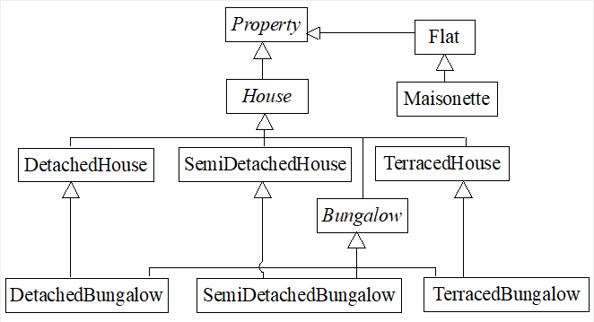
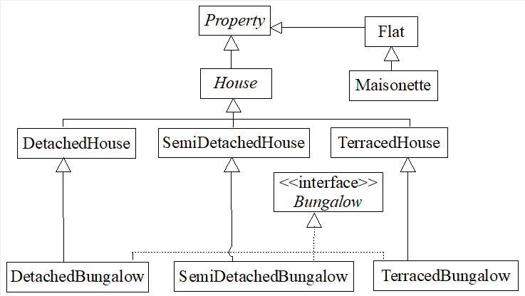

[Back to questions](../README.md)

## Solution to [0c21](../questions/0c21.md): *Properties*

See code at `solutions/code/tutorialquestions/question0c21`

The point of this question was to demonstrate that thinking about inheritance hierarchies, and specifically
how to map them to a single-inheritance language like Java, can be challenging.  There are multiple feasible
solutions to this question.

First, let us consider in some sense the "ideal" class diagram for the desired inheritance hierarchy:

The hierarchy captures the "is-a" relationships described in
the question.  `Property`, `House` and `Bungalow` are abstract, because
the question indicated that all houses and bungalows should be one one of *detached*, *semi-detached*
or *terraced*.  Note that `Flat` is *not* abstract: the question indicated that a maisonette
is a special kind of flat, but this implied that regular flats should exist.

Multiple inheritance creeps in because `DetachedBungalow` inherits from both `DetachedHouse`
and `Bungalow`.

Because we cannot have multiple inheritance in Java, we need to find a way to simulate this using interfaces.
In my mind there are two reasonable ways to do this:

* Make `Bungalow` an interface, which the bungalow properties implement, as well as extending their respective
`House` subclasses.  This is what the sample solution does; the class diagram is shown below and the Java
classes are available in the `instanceofsolution` package (the name of this package reflects a later part of the solution; see below).

* Make interfaces `Detached`, `SemiDetached` and `Terraced`.  Keep `Bungalow` as an abstract
class that extends `House`.  Then have `DetachedHouse` extend `House` and implement `Detached`,
and have `DetachedBungalow` extend `Bungalow` and implement `Detached` (the setup for the semi-detached
and terraced property types is analogous).  You might benefit from drawing a class diagram for this arrangement.
However, a problem with this solution is that while a `DetachedBungalow` is an instance of `Bungalow`, `House` and `Detached`, it is not an instance of `DetachedHouse`.
This may be undesirable if we would like to have an is-a relationship between `DetachedBungalow`s and `DetachedHouse`s.
A similar problem affects semi-detached and terraced bungalows,
and for this reason if you implement the second solution you will find that you don't get quite the number of terraced houses when you implement your `main` method.

In the sample solution I have implemented `PropertyCollection` methods in two ways: using `instnaceof`
to test the actual types of properties (see package `instanceofsolution`) and by adding methods
`isHouse()`, `isBungalow()`,
`isFlat()`, etc., to `Property` and using these methods to test the type of a property.

The `instanceof` approach has the advantage that it does not pollute the `Property` class
hierarchy with lots of extra methods.  It seems a shame for an arbitrary property to have to provide
a method saying whether or not it is a maisonette!  On the other hand, the method-based approach is more flexible, and provides
better encapsulation.
Suppose we wished to change our inheritance hierarchy a bit, by adding or removing some classes, or by changing their names.
This would cause client code that queries object types using `instanceof` to break, while calls to the `isHouse()`, etc.,
method would still work (because these methods are defined at the abstract level of `Property`).

