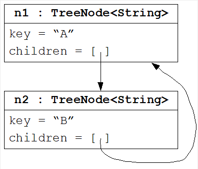
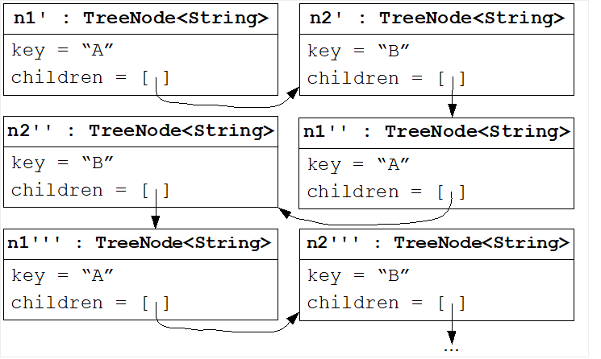
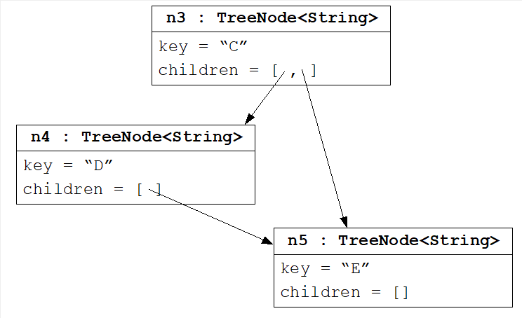
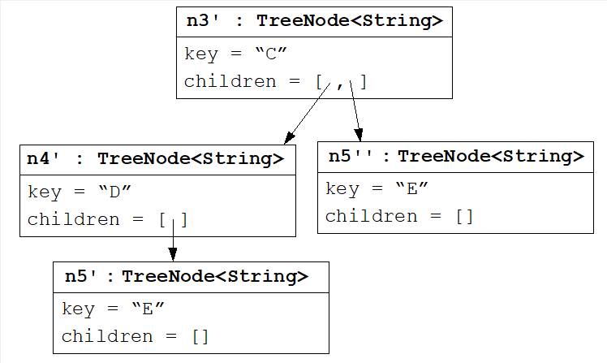

[Back to questions](../README.md)

## Solution to [c822](../questions/c822.md): *Problems cloning tree nodes*

See code at `solutions/code/tutorialquestions/questionc822`

Invoking `n1.clone()`, where `n1` is an object referenced by the following code
fragment and `TreeNode` is the class produced in [question 7041](../questions/7041.md):

```
TreeNode<String> n1 = new TreeNode<String>(1);
n1.setKey("A");
TreeNode<String> n2 = new TreeNode<String>(1);
n2.setKey("B");
n1.setChild(0, n2);
n2.setChild(0, n1);
```

leads to an infinite loop.  The problem is that `n1` is not really a tree node, because `n1` has `n2` as a child, and
`n2` has `n1` as a child.  Thus the nodes form a cyclic graph:



The recursive `clone` method descends forever through this cycle,
building a longer and longer corresponding tree of duplicates of `n1` and `n2`:



Practically, this leads to the program terminating with a `java.lang.StackOverflowError`.

If we invoke `n3.clone()`, where `n3` is an object referenced by the following code
fragment:

```
TreeNode<String> n3 = new TreeNode<String>(2);
n3.setKey("C");
TreeNode<String> n4 = new TreeNode<String>(1);
n4.setKey("D");
TreeNode<String> n5 = new TreeNode<String>(0);
n5.setKey("E");
n3.setChild(0, n4);
n3.setChild(1, n5);
n4.setChild(0, n5);
```

then `clone` terminates, but the structure produced does not match the original.  This is because
`n3`, `n4` and `n5` do not really form a tree, they actually form a directed
acyclic graph (DAG) that is not a tree.  This is because node `n5` has both
`n3` and `n4` as a parent:



The `clone` method will produce a tree from this DAG in which the `n5` node has been duplicated:



**Preconditions for `setChild()`:**  When `child` is passed as argument
to `setChild`, it must be the case that `child` does not already have a parent.  This avoids the
construction of a DAG that is not a tree.  Also, when `child` is passed as an argument to `setChild`,
it must be the case that the tree node on which `setChild` is being invoked is not a (direct or indirect)
descendent of `child`.  This ensures that cyclic structures are not created.

**Advanced:** Look at `TreeNode` in the `precondition` package.  This class implements these precondition checks.
The single-parent check is made by equipping each `TreeNode` with a `numberOfParents` field.  The
implementation of `setChild` is then responsible for checking and maintaining this field.  Unfortunately this
does lead to added complexity in `setChild`.  The check that the child node does not reach its parent is
implemented through a recursive method `reaches`, which performs a depth-first search for the parent, starting from the child.

